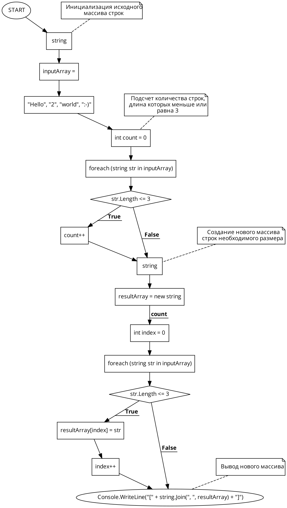

# FCWBB
# Final control work on the basic block

Шаг 1: Создание репозитория на GitHub
Перейдите на GitHub.
Войдите в свою учетную запись.
Создатm новый репозиторий, назвав его, например, FCWBB.

Шаг 2: Блок-схема алгоритма
Нарисуем блок-схему алгоритма. Алгоритм можно описать следующими шагами:

Инициализация исходного массива строк.
Подсчет количества строк, длина которых меньше или равна 3.
Создание нового массива строк необходимого размера.
Заполнение нового массива подходящими строками из исходного массива.
Вывод нового массива.

# Шаг 3: Описание решения (README.md)

# FCWBB

## Описание

Программа, которая из имеющегося массива строк формирует новый массив из строк, длина которых меньше, либо равна 3 символам.

## Примеры

- `["Hello", "2", "world", ":-)"]` → `["2", ":-)"]`
- `["1234", "1567", "-2", "computer science"]` → `["-2"]`
- `["Russia", "Denmark", "Kazan"]` → `[]`

## Использование

Программа написана на языке C#. Исходный массив можно задать в коде программы или ввести с клавиатуры.

## Запуск

Для запуска программы откройте проект в Visual Studio и запустите его. -->

# Шаг 4: Программа на C#
Создадим программу, решающую поставленную задачу: